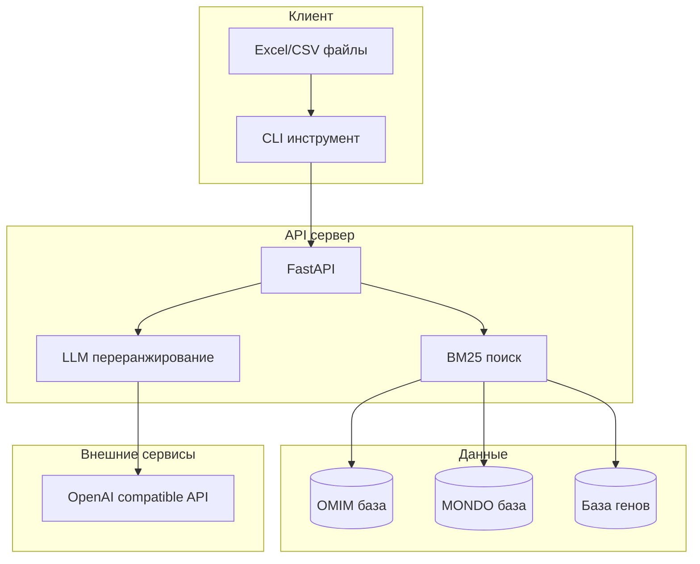

# Архитектура системы Clinical Disease Matcher

## Обзор

Clinical Disease Matcher - это система для автоматического сопоставления клинических диагнозов с международными кодами заболеваний OMIM и MONDO.

## Компоненты системы

## Поток обработки данных

1. **Загрузка файла**
   - CLI читает Excel/CSV файл
   - Автоматически определяет столбцы с диагнозами и генами

2. **Отправка запросов**
   - CLI отправляет диагнозы на API сервер
   - Поддерживается параллельная обработка

3. **BM25 поиск**
   - Генерация нескольких вариантов запроса через LLM
   - Поиск по индексу заболеваний и синонимов
   - Возвращает топ-20 кандидатов

4. **LLM переранжирование**
   - LLM анализирует кандидатов
   - Учитывает контекст и информацию о генах
   - Выбирает наиболее подходящий результат

5. **Формирование результата**
   - Добавление кодов OMIM/MONDO к данным
   - Пометка случаев требующих уточнения
   - Сохранение обработанного файла

## Ключевые решения

### Гибридный подход
- **BM25** для быстрого поиска релевантных кандидатов
- **LLM** для точного выбора из кандидатов

### Работа с русским языком
- Генерация английских вариантов через LLM
- Использование медицинского словаря как fallback
- Сохранение оригинального контекста

### Обработка генов
- Валидация соответствия ген-заболевание
- Использование genemap2.txt для связей
- Приоритет названию заболевания над геном

### Масштабируемость
- Асинхронная обработка запросов
- Параллельная обработка файлов
- Настраиваемое количество воркеров

## Базы данных

### OMIM (Online Mendelian Inheritance in Man)
- ~17,500 записей заболеваний
- Фокус на генетических заболеваниях
- Связи с генами через genemap2.txt

### MONDO (Monarch Disease Ontology)
- ~23,700 записей заболеваний
- Интеграция множества источников
- Богатая онтология и синонимы

### Фильтрация данных
- Исключение записей генов (только заболевания)
- Загрузка всех синонимов и альтернативных названий
- Кросс-ссылки между базами

## Безопасность

- API ключи хранятся в переменных окружения
- Нет сохранения персональных данных
- Логирование без чувствительной информации

## Производительность

### Метрики
- Время обработки: 5-20 сек на диагноз
- Точность: ~91% для диагнозов с генами
- Параллельность: до 10 запросов одновременно

### Оптимизации
- Локальный BM25 индекс (без внешних API)
- Кеширование промежуточных результатов
- Батчинг запросов к LLM

## Расширяемость

### Добавление новых баз данных
1. Реализовать загрузчик в `data_loader.py`
2. Добавить индексацию в `search_engine_bm25.py`
3. Обновить логику в `hybrid_orchestrator.py`

### Изменение промптов
- Промпты хранятся в текстовых файлах
- Можно менять без изменения кода
- Требуется перезапуск сервиса

### Новые языки
- Система готова к мультиязычности
- Требуется адаптация промптов